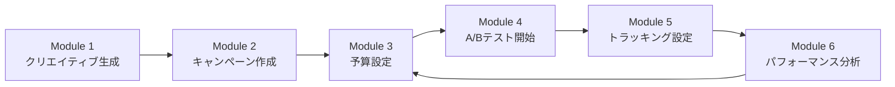

# Meta広告自動化プロジェクト

Meta（Facebook/Instagram）広告の自動化を実現する6つのMCPサーバー群です。クリエイティブ生成からキャンペーン作成、予算最適化、A/Bテスト、トラッキング、レポート生成まで、広告運用の全プロセスを自動化します。

## 📋 目次

- [概要](#概要)
- [モジュール構成](#モジュール構成)
- [システム要件](#システム要件)
- [セットアップ](#セットアップ)
- [使い方](#使い方)
- [ワークフロー例](#ワークフロー例)
- [トラブルシューティング](#トラブルシューティング)
- [ライセンス](#ライセンス)

## 概要

このプロジェクトは、Meta Marketing API（v25.0）を活用した広告自動化ツールセットです。2026年のAdvantage+必須化に対応し、最新のODAX（Outcome-Driven Ad Experiences）構造をサポートしています。

### 主な特徴

- **🎨 AI駆動のクリエイティブ生成**: Gemini API（画像）+ Claude API（コピー）
- **🚀 Advantage+ 完全対応**: 2026年必須のターゲティング自動化
- **💰 予算最適化エンジン**: CBO管理 + ルールベース自動化
- **🧪 統計的A/Bテスト**: 有意差判定 + 自動スケーリング
- **📊 Pixel + CAPI 統合**: 重複排除 + イベント品質診断
- **📈 レポート自動生成**: Insights API + Markdown/CSV出力

## モジュール構成

| # | モジュール名 | 説明 | 主要機能 |
|---|-------------|------|---------|
| **1** | [meta-ad-creative-mcp](./meta-ad-creative-mcp/) | クリエイティブ自動生成 | 画像生成（Gemini）、コピー生成（Claude）、バリエーション作成 |
| **2** | [meta-campaign-mcp](./meta-campaign-mcp/) | キャンペーン自動作成 | Campaign/AdSet/Ad 一括作成、Advantage+ 対応 |
| **3** | [meta-budget-mcp](./meta-budget-mcp/) | 予算最適化 | CBO管理、自動ルール、入札戦略最適化 |
| **4** | [meta-experiment-mcp](./meta-experiment-mcp/) | A/Bテスト自動化 | Experiments API、統計的有意差判定、勝者スケーリング |
| **5** | [meta-tracking-mcp](./meta-tracking-mcp/) | トラッキング | Pixel + Conversions API、重複排除、診断 |
| **6** | [meta-report-mcp](./meta-report-mcp/) | レポート自動生成 | Insights API、パフォーマンス分析、自動推奨 |

## システム要件

- **Node.js**: v18.0.0 以上
- **npm**: v9.0.0 以上
- **Meta Business Manager アカウント**
- **Claude API アクセス** (Anthropic)
- **Gemini API アクセス** (Google)

## セットアップ

### 1. リポジトリのクローン

```bash
git clone <repository-url>
cd snsauto
```

### 2. 環境変数の設定

プロジェクトルートに `.env` ファイルを作成します。詳細は [SETUP_GUIDE.md](./SETUP_GUIDE.md) を参照してください。

```bash
# Meta Marketing API
META_ACCESS_TOKEN=your_meta_access_token
META_AD_ACCOUNT_ID=act_1234567890
META_PAGE_ID=1234567890
META_PIXEL_ID=1234567890
META_TEST_EVENT_CODE=TEST12345

# AI APIs
ANTHROPIC_API_KEY=sk-ant-xxx
GEMINI_API_KEY=AIzaSyXXX

# Optional
DRY_RUN=true  # テストモード（本番API呼び出しなし）
```

### 3. 各モジュールの依存関係をインストール

```bash
# 一括インストール
npm run install-all

# または個別にインストール
cd meta-ad-creative-mcp && npm install
cd ../meta-campaign-mcp && npm install
cd ../meta-budget-mcp && npm install
cd ../meta-experiment-mcp && npm install
cd ../meta-tracking-mcp && npm install
cd ../meta-report-mcp && npm install
```

### 4. MCP サーバーの登録

`~/.claude/settings.json` に各モジュールを登録します：

```json
{
  "mcpServers": {
    "meta-ad-creative": {
      "command": "node",
      "args": ["C:/path/to/snsauto/meta-ad-creative-mcp/index.js"]
    },
    "meta-campaign": {
      "command": "node",
      "args": ["C:/path/to/snsauto/meta-campaign-mcp/index.js"]
    },
    "meta-budget": {
      "command": "node",
      "args": ["C:/path/to/snsauto/meta-budget-mcp/index.js"]
    },
    "meta-experiment": {
      "command": "node",
      "args": ["C:/path/to/snsauto/meta-experiment-mcp/index.js"]
    },
    "meta-tracking": {
      "command": "node",
      "args": ["C:/path/to/snsauto/meta-tracking-mcp/index.js"]
    },
    "meta-report": {
      "command": "node",
      "args": ["C:/path/to/snsauto/meta-report-mcp/index.js"]
    }
  }
}
```

### 5. 統合テストの実行

```bash
node integration-test.js
```

期待される出力：
```
✓ 成功: 5
✗ 失敗: 0
⚠ スキップ: 1
```

## 使い方

### Claude Code から使用

各モジュールは Claude Code の MCP ツールとして利用可能です：

```
# Module 1: クリエイティブ生成
- list_templates
- generate_ad_copy
- generate_ad_image
- generate_ad_creative
- generate_ad_variations

# Module 2: キャンペーン作成
- setup_check
- create_campaign
- create_full_campaign
- get_campaign_status
- set_campaign_status

# Module 3: 予算最適化
- get_budget_overview
- update_budget
- create_rule
- list_rules
- evaluate_rules

# Module 4: A/Bテスト
- create_experiment
- list_experiments
- get_experiment_results
- end_experiment
- analyze_winner

# Module 5: トラッキング
- setup_check
- send_event
- send_batch_events
- get_pixel_code
- get_event_diagnostics

# Module 6: レポート生成
- get_performance_report
- get_creative_report
- get_audience_report
- get_trend_report
- export_report
```

### スタンドアロンで使用

各モジュールは独立して実行可能です：

```bash
# 例: クリエイティブ生成
cd meta-ad-creative-mcp
node index.js

# 例: スモークテスト実行
cd meta-campaign-mcp
node test/smoke-test.js
```

## ワークフロー例

### シナリオ: 新商品キャンペーンの立ち上げ



#### ステップ1: クリエイティブ生成

```javascript
// Module 1: 商品画像とコピーを生成
generate_ad_creative({
  campaign_id: "winter_sale_2026",
  product_name: "ウィンターコート",
  target_audience: "25-45歳女性、ファッション関心層",
  key_message: "最大50%オフ、送料無料",
  ad_formats: ["feed_square", "story"]
})
// Output: meta-ad-creative-mcp/output/winter_sale_2026/{timestamp}/creative.json
```

#### ステップ2: キャンペーン作成

```javascript
// Module 2: Advantage+ キャンペーン作成
create_full_campaign({
  campaign_name: "Winter Sale 2026",
  objective: "sales",
  daily_budget: 10000,  // 10,000円/日
  creative_path: "meta-ad-creative-mcp/output/winter_sale_2026/.../creative.json",
  dry_run: false  // 本番実行
})
```

#### ステップ3: 予算最適化ルール設定

```javascript
// Module 3: 高CPAで自動停止するルール
create_rule({
  name: "Pause High CPA Ads",
  template: "pause_high_cpa",
  params: {
    cpa_threshold: 3000,  // 3,000円以上
    evaluation_period_days: 3
  }
})
```

#### ステップ4: A/Bテスト開始

```javascript
// Module 4: クリエイティブA vs B
create_experiment({
  name: "Creative Test: Product Image vs Lifestyle",
  test_variable: "creative",
  control_ad_id: "ad_001",
  variant_ad_ids: ["ad_002"],
  test_objective: "conversion_rate",
  confidence_level: 90
})
```

#### ステップ5: コンバージョントラッキング

```javascript
// Module 5: 購入イベント送信
send_event({
  event_name: "Purchase",
  event_time: Math.floor(Date.now() / 1000),
  user_data: {
    em: "customer@example.com",  // 自動でSHA-256ハッシュ化
    ph: "09012345678"
  },
  custom_data: {
    value: 15800,
    currency: "JPY"
  }
})
```

#### ステップ6: パフォーマンス分析

```javascript
// Module 6: 過去7日間のレポート生成
get_performance_report({
  date_preset: "last_7d",
  level: "ad",
  breakdowns: ["age", "gender"],
  format: "markdown"
})
```

## トラブルシューティング

### よくある問題

#### 1. `META_ACCESS_TOKEN` エラー

**エラー**: `Error: META_ACCESS_TOKEN is required`

**解決策**:
```bash
# .env ファイルを作成して環境変数を設定
META_ACCESS_TOKEN=your_token_here

# または一時的に設定
export META_ACCESS_TOKEN=your_token_here  # Linux/Mac
set META_ACCESS_TOKEN=your_token_here     # Windows
```

#### 2. Gemini API エラー

**エラー**: `Gemini API key not found`

**解決策**:
```bash
# google-flow-mcp/apikey.txt にキーを保存
echo "AIzaSyXXX" > google-flow-mcp/apikey.txt
```

#### 3. dry_run モードが解除されない

**問題**: 本番実行したいのに dry_run が有効

**解決策**:
```javascript
// 各ツール呼び出し時に明示的に指定
tool_name({
  // ...他のパラメータ
  dry_run: false  // 明示的にfalseを指定
})
```

#### 4. MCP サーバーが認識されない

**解決策**:
1. `~/.claude/settings.json` のパスが正しいか確認
2. Claude Code を再起動
3. `node index.js` で手動起動してエラー確認

### デバッグモード

各モジュールはデバッグ出力に対応しています：

```bash
DEBUG=* node meta-campaign-mcp/index.js
```

## API ドキュメント

各モジュールの詳細なAPI仕様は、各ディレクトリ内の README を参照してください：

- [Module 1: meta-ad-creative-mcp/README.md](./meta-ad-creative-mcp/README.md)
- [Module 2: meta-campaign-mcp/README.md](./meta-campaign-mcp/README.md)
- [Module 3: meta-budget-mcp/README.md](./meta-budget-mcp/README.md)
- [Module 4: meta-experiment-mcp/README.md](./meta-experiment-mcp/README.md)
- [Module 5: meta-tracking-mcp/README.md](./meta-tracking-mcp/README.md)
- [Module 6: meta-report-mcp/README.md](./meta-report-mcp/README.md)

## 技術仕様

### Meta Marketing API

- **バージョン**: v25.0
- **認証**: OAuth アクセストークン
- **必須スコープ**: `ads_management`, `ads_read`, `business_management`
- **推奨**: System User Token（期限なし）

### 2026年の重要な変更点

- **Advantage+ 必須化**: ASC/AAC API は 2026年Q1 で廃止
- **ODAX 構造**: 6つの目的（sales, leads, awareness, traffic, engagement, app_promotion）
- **ターゲティング自動化**: `targeting_automation` 必須

### データフロー

```
Module 1 (Creative)
    ↓ creative.json
Module 2 (Campaign)
    ↓ campaign_id, adset_id, ad_id
Module 3 (Budget) ←→ Module 4 (Experiment)
    ↓ performance metrics
Module 5 (Tracking) → Conversions API
    ↓ event data
Module 6 (Report) → Insights API
    ↓ analysis & recommendations
```

## 貢献

このプロジェクトはオープンソースです。Issue や Pull Request を歓迎します。

### 開発ガイドライン

1. 各モジュールは独立して動作すること
2. 環境変数は `.env` で管理
3. `dry_run` モードをデフォルトで有効にすること
4. エラーハンドリングを徹底すること
5. スモークテストを追加すること

## ライセンス

MIT License - 詳細は [LICENSE](./LICENSE) を参照

## サポート

- **Issues**: [GitHub Issues](https://github.com/your-repo/issues)
- **Email**: ikedachiin@gmail.com

## 謝辞

- Meta Marketing API: https://developers.facebook.com/docs/marketing-apis
- Anthropic Claude API: https://docs.anthropic.com/
- Google Gemini API: https://ai.google.dev/

---

**作成日**: 2026-02-23
**最終更新**: 2026-02-23
**バージョン**: 1.0.0
