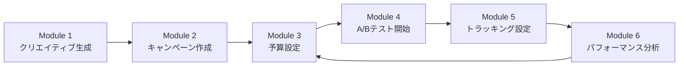

# TAISUN v2

**Unified Development & Marketing Platform** - AIエージェント、MCPツール、マーケティングスキルを統合した次世代開発プラットフォーム

---

## 🚀 TSIS クイックスタート（SNS自動化）

**TSIS (TAISUN SNS Intelligence System)** - キーワードからSNS投稿＋動画台本を自動生成

### セットアップ

```bash
# 1. リポジトリをクローン
git clone https://github.com/ikedachiin-maker/snsauto2.git
cd snsauto2

# 2. 依存関係をインストール
npm install

# 3. ビルド
npm run build:all

# 4. デモ実行
npx ts-node scripts/tsis-demo.ts "AI副業"
```

### 出力内容

| 出力 | 内容 |
|------|------|
| 📝 記事（2000文字〜） | SEO対策済みMarkdown |
| 📱 SNS投稿×4 | Twitter, Instagram, LinkedIn, Threads |
| 🎬 動画台本×3 | TikTok, Reels, Shorts（60秒構成） |

### 出力ファイル

```
output/tsis-demo/
├── article_*.md              # 記事本文
├── distribution_*.json       # 配信データ（全体）
├── script_tiktok_*.md        # TikTok台本
├── script_instagram_reels_*.md   # Reels台本
└── script_youtube_shorts_*.md    # Shorts台本
```

### 詳細ドキュメント

👉 [TSIS スキルドキュメント](.claude/skills/sns-intelligence-system/SKILL.md)

---

## 109スキル完全ガイド（14カテゴリ）

> TAISUN Agent v2.30.0 搭載の全109スキルをカテゴリ別に分類。

### スキルの呼び出し方

```
# 方法1: スラッシュコマンド
/skill-name [引数]

# 方法2: 自然言語トリガー
「リサーチして」「LPを作って」「太陽スタイルで書いて」

# 方法3: Skill tool経由
Skill tool → skill: "skill-name", args: "引数"
```

- スキル指定がある場合は **必ずSkill toolを使用**（手動実装は禁止）
- `-free`系スキルはAPIキー不要で動作

---

### 1. リサーチ・情報収集（14スキル）

| スキル | コマンド | 特徴 |
|--------|---------|------|
| **research** | `/research [トピック]` | ワンコマンド深層調査。出典付きレポート自動生成 |
| **research-free** | `/research-free [トピック] [--depth=quick\|standard\|deep]` | APIキー不要。WebSearchのみで動作 |
| **research-cited-report** | 「出典付きレポートを作って」 | 一次情報優先の構造化レポート |
| **mega-research** | `/mega-research [トピック] [--mode=deep\|quick\|news\|trend]` | 6API統合（Tavily/SerpAPI/Brave/NewsAPI/Reddit/Perplexity） |
| **mega-research-plus** | `/mega-research-plus [トピック] [--mode=deep\|quick\|news\|social\|free]` | 8ソース統合。`free`モードでAPIキー不要 |
| **unified-research** | 「リサーチして」「調べて」 | 5API統合リサーチ |
| **world-research** | `/world-research キーワード=[KW]` | 50+プラットフォーム横断（X/Reddit/YouTube/note/Arxiv等）。日英中3言語 |
| **gem-research** | `/gem-research <業界> [--mode=quick\|standard\|deep]` | Marketing AI Factory向け9層リサーチ |
| **gpt-researcher** | リサーチクエリで自動発動 | 自律型Deep Research。50+ソース横断 |
| **dr-explore** | `/dr-explore` | Deep Research探索フェーズ。evidence.jsonl生成 |
| **dr-synthesize** | `/dr-synthesize` | 証拠統合→レポート＋実装計画生成 |
| **dr-build** | `/dr-build` | 実装計画→コード落とし込み |
| **apify-research** | 「Instagramを調査」「Amazon商品をリサーチ」 | Apify MCP経由。SNS/EC/検索エンジンスクレイピング |
| **note-research** | `/note-research ジャンル=[名前]` | note.com特化。トレンド・売れ筋パターン分析。コスト0円 |

---

### 2. 太陽スタイル・コピーライティング（12スキル）

> 日給5000万円を生み出した太陽スタイルのコピーライティング技術群

**メインスキル**

| スキル | コマンド | 用途 |
|--------|---------|------|
| **taiyo-style** | 「太陽スタイルで書いて」 | マスタースキル。対話型コピー・感情のジェットコースター・数値とストーリー融合 |
| **taiyo-analyzer** | 「太陽スタイルで分析して」 | 176パターンに基づく6次元スコアリング（0〜100点） |
| **taiyo-rewriter** | 「太陽スタイルにリライトして」 | スコアに応じて軽微調整〜全面リライト |

**専門スキル**

| スキル | コマンド | 用途 |
|--------|---------|------|
| **taiyo-style-headline** | `/taiyo-style-headline` | ヘッドライン10案自動生成（開封率3.2倍・CTR4.7倍） |
| **taiyo-style-bullet** | `/taiyo-style-bullet` | ブレット・ベネフィットリスト（購買意欲3.8倍） |
| **taiyo-style-lp** | `/taiyo-style-lp` | 12セクション完全準拠LP（成約率4.3倍） |
| **taiyo-style-sales-letter** | `/taiyo-style-sales-letter [商品名]` | 27ブロック構造セールスレター（Sランク品質自動保証） |
| **taiyo-style-step-mail** | `/taiyo-style-step-mail` | 7〜14通ステップメール（6教育要素+心理トリガー） |
| **taiyo-style-vsl** | `/taiyo-style-vsl` | 35〜45分・15章VSL台本（感情曲線設計） |
| **taiyo-style-ps** | `/taiyo-style-ps` | 追伸生成（7つの黄金パターン） |
| **copywriting-helper** | 「セールスレターを書いて」 | テンプレートベースコピー作成 |
| **customer-support-120** | 「120%の返信を作成して」 | 神対応返信生成（6教育要素・2000文字以上） |

---

### 3. LP（ランディングページ）制作（8スキル）

| スキル | コマンド | 特徴 |
|--------|---------|------|
| **lp-design** | 「LP設計して」 | オプトイン/セールス/漫画LP設計。7要素構成テンプレート |
| **lp-full-generation** | `/lp-full-generation` | RAG+ローカルLLMで12セクション全生成（コスト0円）。70点未満は自動再生成 |
| **lp-local-generator** | `/lp-local-generator <section>` | セクション単位のローカル生成。API費用0円 |
| **lp-analysis** | 「LPを分析して」 | 太陽スタイル基準で分析し3フェーズ改善ロードマップ提案 |
| **lp-analytics** | `/lp-analytics` | LP知識ベース（1096チャンク）の統計分析・共通パターン抽出 |
| **lp-json-generator** | 「この画像で文字だけ変えて」 | 参考画像のデザインを維持しながらテキスト差替え |
| **mendan-lp** | 「面談LPを作って」 | 面談申込率50%の4パターン（ストーリー型/タイムライン型/Q&A型/神話崩し型） |
| **figma-design** | FigmaのURLを含める | FigmaデザインからReact/CSSコードをピクセルパーフェクトに生成 |

---

### 4. 動画・コンテンツ制作（10スキル）

| スキル | コマンド | 用途 |
|--------|---------|------|
| **shorts-create** | `/shorts-create [トピック]` | ショート動画全自動制作（リサーチ→スクリプト→画像→音声→レンダリング→検証） |
| **video-agent** | `/video-agent download\|transcribe\|produce` | 統合動画自動化（yt-dlp/Whisper/FFmpeg/Remotion） |
| **youtube-content** | 「YouTube動画の企画・台本作成」 | ショート(60秒)と長尺(10-20分)の台本作成 |
| **youtube-thumbnail** | 「サムネイルを作って」 | CTR向上サムネイル作成ガイド（4パターン） |
| **youtube_channel_summary** | `/youtube_channel_summary [URL]` | チャンネル分析（テーマ・パターン・競合分析） |
| **launch-video** | 「ローンチ動画の台本を作って」 | 4話構成×8パート（各70分）のローンチ動画スクリプト |
| **telop** | `/テロップ [動画種類] [内容]` | ショート動画用テロップ作成（4種類のスタイル） |
| **anime-slide-generator** | `/slides` `/anime-slides` | アニメ風スライド自動生成（NanoBanana Pro+Pillow） |
| **anime-production** | 「アニメ動画作成」 | アニメ動画・広告・キャラクターアニメーション制作 |
| **omnihuman1-video** | 「AIアバター動画を作って」 | 1枚の画像+音声からリップシンクAIアバター動画を生成 |

---

### 5. SNSマーケティング（5スキル）

| スキル | コマンド | 用途 |
|--------|---------|------|
| **sns-marketing** | `make sns-workflow PLATFORM=x` | 5役割分離ワークフロー（戦略→制作→レビュー→投稿→分析） |
| **sns-patterns** | 「SNS投稿を作って」 | X/Instagram/YouTube/noteの投稿パターン・炎上対策 |
| **note-marketing** | 「note記事を作って」 | note.com記事作成＋無料→有料ファネル設計 |
| **line-marketing** | 「LINEステップメッセージを設計して」 | 10日間シナリオ＋リッチメニュー設計 |
| **education-framework** | 「ステップメール設計」 | 6教育要素フレームワーク（目的・問題・解決策・価値・信用・行動） |

---

### 6. セールス・ファネル構築（8スキル）

| スキル | コマンド | 用途 |
|--------|---------|------|
| **funnel-builder** | `/funnel-builder [platform]` | Kindle/note/YouTube/SNS→LINE→VSLファネル統合構築 |
| **sales-systems** | 「VSLスクリプトを作って」 | VSL・セミナー台本・個別相談トーク設計 |
| **kindle-publishing** | 「Kindle本を書いて」 | 10章構成・1章3000-5000文字の電子書籍作成 |
| **lead-scoring** | 「リードをスコアリングして」 | 4次元スコアリング（HOT/WARM/COLD/DISQUALIFIED） |
| **outreach-composer** | 「リードにメッセージを送って」 | LINE/メール/SMS/音声でパーソナライズメッセージ送信 |
| **ai-sdr** | `/workflow-start sdr_pipeline_v1` | 自律型営業AI（リード取込→スコアリング→4チャネル自動送信） |
| **voice-ai** | 「アウトバウンドコール自動化」 | Twilio+OpenAI音声AIで電話発信・IVR・SMS自動化 |
| **customer-support-120** | 「120%の返信を作成して」 | 神対応カスタマーサポート返信生成 |

---

### 7. 画像生成・デザイン（6スキル）

| スキル | コマンド | 用途 |
|--------|---------|------|
| **nanobanana-pro** | 「画像を生成して」 | Gemini NanoBanana Proでテキスト→画像生成 |
| **nanobanana-prompts** | 「画像プロンプトを作って」 | NanoBanana向け最適化プロンプト生成（フェイススワップ等） |
| **custom-character** | 「キャラクター画像を作って」 | キャラクター一貫性を保ったバリエーション生成 |
| **diagram-illustration** | 「図解を作って」 | フロー図・比較図・構造図等のインフォグラフィック生成 |
| **agentic-vision** | `/agentic-vision` | Gemini 3 Flashで画像・動画の高度分析 |
| **figma-design** | FigmaのURLを含める | Figmaデザインからコード生成 |

---

### 8. URL分析（2スキル）

| スキル | コマンド | 特徴 |
|--------|---------|------|
| **url-all** | `/url-all <URL> [--mode=quick\|standard\|deep\|competitive\|seo\|audit\|links]` | ローカルLLM完全把握。Playwright MCP + Ollamaで7モード・7層分析。APIキー不要 |
| **url-deep-analysis** | `/url-deep-analysis <URL> [--depth=1\|2\|3] [--mode=full\|structure\|design\|content\|links]` | 5層完全解析。WebFetch・Playwright・curlを自動選択 |

---

### 9. キーワード・SEO（4スキル）

| スキル | コマンド | 用途 |
|--------|---------|------|
| **keyword-free** | `/keyword-free <シードKW>` | APIキー不要キーワード抽出（WebSearchのみ） |
| **keyword-mega-extractor** | `/keyword-mega-extractor <シードKW>` | 複数API統合8タイプキーワード大量抽出 |
| **keyword-to-gem** | `/keyword-to-gem <キーワード>` | KW→SNS横断検索→NotebookLM→Gem作成まで全自動 |

---

### 10. 設計・ドキュメント（SDD系 12スキル）

> Spec-Driven Development: 仕様駆動開発の完全パイプライン

**推奨実行順序:**
```
/sdd-stakeholder → /sdd-context → /sdd-glossary → /sdd-event-storming
→ /sdd-req100 → /sdd-design → /sdd-slo → /sdd-threat
→ /sdd-tasks → /sdd-runbook → /sdd-guardrails → /sdd-adr
```

**一括実行:** `/sdd-full [spec-slug]` — 7成果物を依存順に自動生成（C.U.T.E.スコア>=98目標）

| スキル | 出力 | 役割 |
|--------|------|------|
| **sdd-stakeholder** | stakeholder-map.md | ステークホルダー特定（Power/Interest Grid・RACI） |
| **sdd-context** | business-context.md | ビジネス目標整合（PR-FAQ・OKR・Impact Map） |
| **sdd-glossary** | glossary.md | 用語辞書（DDD Ubiquitous Language） |
| **sdd-event-storming** | event-storming.md | ドメイン知識可視化（Events・Commands・Aggregates） |
| **sdd-req100** | requirements.md | 要件定義（EARS準拠・105点満点スコアリング） |
| **sdd-design** | design.md | アーキテクチャ設計（C4 Model・Arc42） |
| **sdd-slo** | slo.md | SLI/SLO/SLA定義（Prometheusルール付き） |
| **sdd-threat** | threats.md | STRIDE脅威分析（リスクスコアリング・DFD図） |
| **sdd-tasks** | tasks.md | タスク分解（1-4時間粒度・Mermaidガント） |
| **sdd-runbook** | runbook.md | 運用手順書（SEV1-4定義・コピペ実行コマンド） |
| **sdd-guardrails** | guardrails.md | AIエージェント安全設計（権限境界・監査証跡） |
| **sdd-adr** | adr-XXX.md | 技術選択記録（MADR形式・代替案3つ以上） |

---

### 11. 開発・DevOps（10スキル）

| スキル | コマンド | 用途 |
|--------|---------|------|
| **batch** | `/batch <タスク>` | git worktreeで並列エージェントチームによる大規模変更 |
| **dual-ai-review** | `/dual-ai-review` | 2AI並列レビュー（実装AI+検証AI）。バグ30-60%削減 |
| **context7-docs** | プロンプトに「use context7」 | React/Next.js/Tailwind等の最新公式ドキュメント取得 |
| **security-scan-trivy** | 「脆弱性スキャンして」 | Trivyセキュリティスキャン |
| **docker-mcp-ops** | 「Dockerを操作して」 | MCP経由Dockerコンテナ管理 |
| **phase1-tools** | `make setup` / `make verify` | ドキュメント処理ツール群管理（Pandoc/Marp/Gotenberg） |
| **phase2-monitoring** | 「監視を設定して」 | Prometheus/Grafana/Loki監視スタック管理 |
| **opencode-fix** | 「バグを修正して」 | mistakes.md参照→再発防止チェック→最小差分修正 |
| **opencode-ralph-loop** | `/opencode-ralph-loop` | OpenCode反復開発ループ（max-iterations必須） |
| **opencode-setup** | 「OpenCodeをセットアップしたい」 | OpenCode CLI導入・設定ガイド |

---

### 12. メモリ・知識管理（4スキル）

| スキル | コマンド | 用途 |
|--------|---------|------|
| **hierarchical-memory** | 「これを長期記憶に保存して」 | 3層階層メモリ（ショート/ロング/エピソード）。精度26%向上 |
| **qdrant-memory** | 「これを覚えておいて」 | Qdrantベクターデータベースでセマンティック検索・永続記憶 |
| **notion-knowledge-mcp** | Notion保存・検索時 | Notion MCP経由で知識の検索・追記・整理 |
| **agent-trace** | `/agent-trace` | AI生成コードの帰属追跡・統計・レポート |

---

### 13. 営業自動化（5スキル）

| スキル | コマンド | 用途 |
|--------|---------|------|
| **ai-sdr** | `/workflow-start sdr_pipeline_v1` | 自律型営業AI（リード→スコアリング→4チャネル送信） |
| **lead-scoring** | 「リードをスコアリングして」 | 4次元HOT/WARM/COLD分類 |
| **outreach-composer** | 「リードにメッセージを送って」 | パーソナライズアウトリーチ（LINE/Email/SMS/Voice） |
| **voice-ai** | 「アウトバウンドコール自動化」 | Twilio+OpenAIで電話自動化 |
| **workflow-automation-n8n** | n8nワークフロー設計依頼 | n8n自動化ワークフロー設計（6要素分解） |

---

### 14. その他ユーティリティ（9スキル）

| スキル | コマンド | 用途 |
|--------|---------|------|
| **pdf-processing** | 「PDFを読んで」 | PDF処理（テキスト抽出/テーブル取得/結合/分割/OCR） |
| **pdf-automation-gotenberg** | 「PDFに変換して」 | HTML/Office/URL→PDF変換（Gotenberg） |
| **doc-convert-pandoc** | 「ドキュメントを変換して」 | Pandocフォーマット変換（Markdown→PDF等） |
| **japanese-tts-reading** | `/japanese-tts-reading` | 日本語テキスト→音声変換（4エンジン対応） |
| **skill-validator** | `/skill-validator [パス]` | スキルファイル品質検証（0-100スコア） |
| **unified-notifications-apprise** | 通知送信依頼 | Email/Discord/Telegram等マルチ通知 |
| **postgres-mcp-analyst** | 「PostgreSQLを分析して」 | MCP経由PostgreSQL分析 |
| **udemy-download** | `/udemy-download <URL>` | Udemyコースダウンロード |
| **kaitori-price-fetch** | `/kaitori-price-fetch` | 買取比較くん定価自動取得 |

---

### ストーリーパターン（物語YouTube台本 5種）

| スキル | パターン | 構造 |
|--------|---------|------|
| **story-pattern-delayed-rescue** | 遅れて届く救い型 | 10幕構成 |
| **story-pattern-flawed-hero** | 傷ある主人公型 | 9幕構成 |
| **story-pattern-inner-conflict** | 内なる葛藤型 | 9幕構成 |
| **story-pattern-systemic-wall** | 組織の壁型 | 9幕構成 |
| **story-pattern-witness-reversal** | 逆転の証人型 | 9幕構成 |

```
# 呼び出し例
/story-pattern-delayed-rescue テーマ:介護 主人公:30代男性 舞台:地方の病院
```

---

### よくある使い方の組み合わせ（パイプライン例）

**Kindle出版:**
```
/keyword-free [テーマ] → /research-free [テーマ] → /kindle-publishing → /nanobanana-pro
```

**LP制作:**
```
/research [商品テーマ] → /taiyo-style-headline → /lp-full-generation → /taiyo-analyzer → /taiyo-rewriter
```

**YouTube動画:**
```
/youtube_channel_summary [競合URL] → /youtube-content → /shorts-create [トピック] → /youtube-thumbnail
```

**営業自動化:**
```
/lead-scoring → /outreach-composer → /ai-sdr → /voice-ai
```

**新サービス設計:**
```
/sdd-full [プロジェクト名]
# または: /sdd-stakeholder → /sdd-context → /sdd-req100 → /sdd-design → /sdd-tasks
```

---

## システム全体像

| コンポーネント | 数量 | 概要 |
|-------------|------|------|
| **エージェント** | 96 | 並列実行可能な専門AIエージェント |
| **スキル** | 109 | 再利用可能なスキルライブラリ |
| **コマンド** | 110+ | スラッシュコマンド（`/command-name`） |
| **MCPサーバー** | 15+ | 外部ツール連携 |
| **フック** | 13層 | 品質・安全性の自動ガード |

### アーキテクチャ（5層構造）

```
ユーザーリクエスト → Coordinator層 → Agent Pool → Skill / MCP → Memory System → レスポンス
```

| 層 | 役割 |
|----|------|
| Layer 1: Coordinator | リクエストを適切なエージェントにルーティング |
| Layer 2: Agent Pool | 96の専門エージェントが並列実行 |
| Layer 3: Skill Library | 109の再利用可能スキル |
| Layer 4: MCP Integration | 外部サービス接続（DB, Notion, Web等） |
| Layer 5: Memory System | エージェント統計・タスク履歴の永続化 |

---

## エージェントシステム（96エージェント）

### コーディネーター（4種）

| エージェント | アルゴリズム |
|------------|-----------|
| `ait42-coordinator` | メモリ統計ベースのエージェント選択 |
| `ait42-coordinator-fast` | ルールベースO(1)選択（軽量） |
| `omega-aware-coordinator` | 確率最適化（Ω関数理論） |
| `self-healing-coordinator` | エラーパターン分析・自動復旧 |

### 開発系エージェント

| カテゴリ | エージェント例 |
|---------|------------|
| **アーキテクチャ（6）** | system-architect, cloud-architect, api-designer, database-designer, security-architect, ui-ux-designer |
| **開発（6）** | backend-developer, frontend-developer, api-developer, database-developer, integration-developer, migration-developer |
| **品質保証（8）** | test-generator, integration-tester, performance-tester, mutation-tester, code-reviewer, qa-validator, security-scanner, security-tester |
| **運用（8）** | devops-engineer, cicd-manager, backup-manager, config-manager, monitoring-specialist, incident-responder, chaos-engineer, release-manager |
| **分析（4）** | complexity-analyzer, feedback-analyzer, log-analyzer, metrics-collector |
| **ドキュメント（3）** | tech-writer, doc-reviewer, knowledge-manager |

### マルチエージェントモード

| モード | 説明 |
|-------|------|
| **Competition** | 複数エージェントが同タスクを競争実行、最良結果を採用 |
| **Debate** | エージェント間で議論し合意形成 |
| **Ensemble** | 複数エージェントの結果を統合 |

### 開発パイプラインエージェント

**Taiyou パイプライン:** `/taiyou-init` → `/taiyou-auto`
- coordinator → codegen → review → issue → pr → deployment

**Miyabi パイプライン:** `/miyabi-init` → `/miyabi-auto`
- coordinator → codegen → review → issue → pr → deployment

### 営業・マーケティングエージェント

| エージェント | 役割 |
|------------|------|
| `meta-ads-agent` | Meta広告管理 |
| `lead-qualifier-agent` | CRMリード判定 |
| `outreach-agent` | アウトリーチメッセージ |
| `sdr-coordinator-agent` | SDR全体統括 |
| `voice-ai-agent` | 音声AI連携 |

### 汎用サブエージェント（永続メモリ付き）

`sub-planner`, `sub-code-reviewer`, `sub-code-searcher`, `sub-implementer`, `sub-test-engineer`, `sub-test-runner-fixer`

---

## コマンドシステム（110+コマンド）

### 開発ライフサイクル

```
/build-feature    /fix-bug          /refactor-code     /deploy
/generate-tests   /generate-docs    /write-docs        /review-code
/review-docs      /validate-quality /verify            /test
```

### 設計・アーキテクチャ

```
/design-architecture  /design-api       /design-database
/design-cloud-architecture              /design-security   /design-ui-ux
```

### テスト

```
/test              /test-chaos        /test-integration
/test-mutation     /test-performance  /test-security
```

### 運用・インフラ

```
/manage-infrastructure  /manage-cicd     /manage-releases
/manage-backups         /manage-config   /manage-incidents
/setup-monitoring       /optimize-containers
```

### ワークフロー制御

```
/workflow-start    /workflow-next     /workflow-status   /workflow-verify
/agent-run         /learn             /capture-learning  /collect-metrics
```

### マーケティング統合

```
/marketing-full    /meta-ads          /meta-ads-full
/lp-normal         /lp-manga          /note-line-vsl     /kindle-line-vsl
/video-course      /omnihuman1-video
```

### MCP操作

```
/mcp-health  /mcp-files  /mcp-git  /mcp-github
/mcp-logs    /mcp-network /mcp-system /mcp-tmux
```

---

## MCPサーバー（15+）

### 常時有効

| サーバー | 機能 |
|---------|------|
| **playwright** | ブラウザ自動化（スクレイピング、フォーム操作、スクリーンショット） |
| **open-websearch** | リアルタイムWeb検索 |
| **taisun-proxy** | 内部ツール統合ハブ（全MCP呼び出しのルーティング） |
| **claude-historian** | セッション履歴管理 |
| **praetorian** | 永続メモリ圧縮（リサーチ結果のクロスセッション保存） |

### オプション（必要時に有効化）

| サーバー | 機能 |
|---------|------|
| **youtube** | YouTube動画情報・コメント分析 |
| **figma** | Figmaデザインデータ読み書き |
| **qdrant** | ベクトル検索データベース |
| **meta-ads** | Meta広告データ取得・最適化 |
| **twitter-client** | X (Twitter) 投稿・分析 |
| **obsidian** | Obsidian vault読み書き |
| **n8n-mcp** | n8nワークフロー自動化 |
| **sequential-thinking** | 段階的推論 |
| **chroma** | ChromaDB ベクトルDB |

### カスタムMCPサーバー（内蔵）

| サーバー | 機能 |
|---------|------|
| `@taisun/ai-sdr-mcp-server` | AI営業自動化（15ツール） |
| `@taisun/voice-ai-mcp-server` | 音声AI（12ツール: 電話発信, IVR, SMS等） |
| `line-bot-mcp-server` | LINE Bot連携 |

### MCPプリセット（用途別最適構成）

```
mcp-presets/
├── marketing.mcp.json      # マーケティング向け
├── research.mcp.json       # リサーチ向け
├── development.mcp.json    # 開発向け
├── video.mcp.json          # 動画制作向け
├── image.mcp.json          # 画像生成向け
└── full-optimized.mcp.json # フル構成（最適化済み）
```

> 各MCPサーバーは1,000〜26,000トークンを消費。有効化は10個以下を推奨。

---

## フックシステム（13層防御マトリックス）

| 層 | ガード | 機能 |
|----|-------|------|
| 0 | `CLAUDE.md` | 絶対遵守ルール（セッション開始時に読み込み） |
| 1 | SessionStart Injector | `.workflow_state.json` を自動注入 |
| 2 | Permission Gate | フェーズ外操作をブロック |
| 3 | Read-before-Write | 未読ファイルの編集をブロック |
| 4 | Baseline Lock | ベースラインスクリプトの変更をブロック |
| 5 | Skill Evidence | スキル呼び出し証拠なしの後処理をブロック |
| 6 | Deviation Approval | 計画逸脱に事前承認を要求 |
| 7 | Agent Enforcement | 複雑タスクにエージェント使用を強制 |
| 8 | Copy Safety | U+FFFD等の文字化けマーカーをブロック |
| 9 | Input Sanitizer | コマンドインジェクション・秘密情報漏洩を検知 |
| 10 | Skill Auto-Select | タスクタイプ別にスキルを自動選択 |
| 11 | Definition Lint | ワークフロー定義ファイルを書き込み時にバリデーション |
| 12 | Context Quality | tmux推奨、console.log警告 |

### その他の主要フック

| フック | 機能 |
|-------|------|
| `model-auto-switch.js` | AIモデル自動切替（後述） |
| `compact-optimizer.js` | 動的な `/compact` タイミング提案 |
| `task-overflow-guard.js` | Task結果2000文字超で自動compact提案 |
| `session-handoff-generator.js` | セッション終了時にSESSION_HANDOFF.mdを自動生成 |
| `auto-memory-saver.js` | 重要な発見をメモリに自動保存 |
| `agent-trace-capture.js` | エージェント実行トレースを記録 |
| `cost-warning.js` | 高API消費時に警告 |
| `anomaly-detector.js` | 行動異常を検知 |
| `violation-recorder.js` | ルール違反を `mistakes.md` に記録 |

---

## AIモデル自動切替システム

サブエージェント（Task tool）起動時に、タスクの複雑度に応じてモデルを自動選択:

| 複雑度 | モデル | 用途例 |
|--------|--------|-------|
| trivial | Haiku | 挨拶・確認・単純応答 |
| simple | Haiku | 検索・一覧表示・状況確認 |
| moderate | Sonnet | ファイル修正・関数追加・テスト作成 |
| complex | Sonnet | 新機能実装・API構築・マルチファイル変更 |
| expert | Opus | アーキテクチャ設計・セキュリティ監査・大規模リファクタリング |

> 予算超過時はHaikuにフォールバック。ユーザー指定が常に最優先。

---

## ワークフローシステム

### ワークフロー忠実性契約

1. 「同じワークフロー」「XXスキルを使って」= **契約** → 省略・代替・独自判断は禁止
2. 既存スクリプトを読まずに新規作成しない
3. 逸脱時は必ず事前確認: 「この行動は指示にありません。実行してよろしいですか？」
4. 現在のフェーズと矛盾しない
5. スキル指定時は **必ずSkill tool使用**（手動実装は禁止）

### 違反時の処理

Stop → 謝罪 → `mistakes.md` に記録 → 正しく再実行

### 自己改善ループ

```
問題解決 → /learn で教訓を記録 → AGENTS.md に蓄積 → 次セッションで自動読み込み
```

---

## メモリシステム

### Praetorian MCP（構造化永続メモリ）

リサーチ結果・Web分析をJSON形式でクロスセッション保存:
```json
{
  "type": "web_research",
  "title": "サイト名 - カテゴリ",
  "source": "URL",
  "key_insights": [...],
  "findings": [...],
  "techniques": {...}
}
```

### AGENTS.md（クロスセッション学習）

- プロジェクトルートのMarkdownファイル
- `/learn` コマンドで教訓を蓄積
- 毎セッション開始時に自動読み込み

### エージェントレベル統計（51エージェント分）

`.claude/memory/agents/` に各エージェントの実行統計をYAMLで保持。成功率・タスク数・品質スコアを記録。

---

## コンテキスト管理

| 設定 | 推奨値 | 理由 |
|-----|-------|------|
| 有効MCPサーバー | 10個以下 | コンテキスト200k→70k縮小を防止 |
| アクティブツール | 80個以下 | 同上 |

### サブエージェント保護（必須）

- 全Taskプロンプトに `結果は500文字以内で要約して返してください` を含める
- 3並列以上のエージェント: `run_in_background: true` **必須**
- Task結果 > 2000文字 → `/compact` 実行

### 最適化実績

コンテキスト: 75K → 30.2Kトークン（**-59.7%**削減）

---

## インストール・セットアップ

### 前提条件

Node.js 18.x+, npm 9.x+, Git 2.x+, Claude Code CLI

### Mac

```bash
git clone https://github.com/taiyousan15/taisun_agent.git ~/taisun_agent
cd ~/taisun_agent && ./scripts/install.sh

# プロジェクトにリンク
ln -sf ~/taisun_agent/.claude .claude
ln -sf ~/taisun_agent/.mcp.json .mcp.json
```

### Windows

```bash
# 方法A（推奨）: 開発者モード ON → bashでシンボリックリンク
# 方法B: 管理者コマンドプロンプトで mklink /D
# 方法C: rsync コピー（シンボリックリンク不要）
```

### アップデート

```bash
cd ~/taisun_agent && git pull origin main && ./scripts/update.sh
```

### 診断コマンド

```bash
npm run taisun:diagnose    # スコア98+で全機能動作
```

| 項目 | 配点 |
|------|------|
| 13層防御フック | 30点 |
| MCP接続 | 25点 |
| スキル定義（109） | 20点 |
| エージェント定義（96） | 15点 |
| ビルド状態 | 10点 |

### コスト削減: LiteLLM / OpenRouter

Claude APIコストを1/3〜1/10に削減:
```bash
OPENROUTER_API_KEY="sk-or-..." GROQ_API_KEY="gsk_..." \
  bash ~/taisun_agent/scripts/setup-litellm.sh
claude-lite    # 安価モデル経由で起動
```

---

## npm scripts 一覧

### 基本操作

```bash
npm run dev              # 開発サーバー起動
npm test                 # テスト実行
npm run lint             # ESLint
npm run typecheck        # TypeScriptチェック
npm run build:all        # 全ビルド
```

### メモリ・メトリクス

```bash
npm run memory:report    # メモリレポート
npm run memory:backup    # メモリバックアップ
npm run metrics:report   # メトリクスレポート（7日/30日）
npm run perf:report      # パフォーマンスレポート
npm run perf:benchmark   # ベンチマーク実行
```

### ワークフロー

```bash
npm run workflow:start   # ワークフロー開始
npm run workflow:status  # ステータス確認
npm run workflow:next    # 次フェーズへ
npm run workflow:verify  # 完了検証
```

### パフォーマンスモード

```bash
npm run perf:fast        # 高速モード（品質↓速度↑）
npm run perf:normal      # 通常モード
npm run perf:strict      # 厳密モード（品質↑速度↓）
```

### セキュリティ

```bash
npm run security:scan         # Trivy脆弱性スキャン
npm run security:secrets-scan # Gitleaks秘密情報スキャン
```

---

## スキル自動マッピング

ユーザー入力に含まれるキーワードでスキルを自動推奨:

| キーワード | 推奨スキル |
|-----------|----------|
| YouTube + チュートリアル + 動画 | video-course |
| セールスレター | taiyo-style-sales-letter |
| ステップメール | taiyo-style-step-mail |
| VSL台本 | taiyo-style-vsl |
| Instagram + ショート | shorts-create |
| 電話 / コール / 音声AI | voice-ai |
| SDR / 営業パイプライン | ai-sdr |
| リードスコアリング | lead-scoring |
| URL分析 / サイト分析 | url-deep-analysis |

---

## URL学習パイプライン

URL分析（`/url-all` `/url-deep-analysis`）実行後の自動5フェーズ:

```
1. コンテンツ理解 → 2. Praetorianメモリ保存 → 3. ノウハウ判定
→ 4. スキル化提案（ノウハウの場合） → 5. ユーザー承認後にスキル生成
```

---

## システム統計

| 指標 | 値 |
|------|-----|
| エージェント | 96 |
| スキル | 109 |
| コマンド | 110+ |
| MCPサーバー | 15+ |
| フック層 | 13 |
| テスト | 775 passing |
| コンテキスト最適化 | 75K → 30K tokens (-60%) |
| 診断スコア | 100/100 |
| リサーチソース数 | 133 |
| 最大並列エージェント | 5（設定変更可） |
| メモリ保持期間 | 90日 / 最大1000タスク |

---

## Meta広告自動化プロジェクト

Meta（Facebook/Instagram）広告の自動化を実現する6つのMCPサーバー群です。クリエイティブ生成からキャンペーン作成、予算最適化、A/Bテスト、トラッキング、レポート生成まで、広告運用の全プロセスを自動化します。

## 📋 目次

- [概要](#概要)
- [モジュール構成](#モジュール構成)
- [システム要件](#システム要件)
- [セットアップ](#セットアップ)
- [使い方](#使い方)
- [ワークフロー例](#ワークフロー例)
- [トラブルシューティング](#トラブルシューティング)
- [ライセンス](#ライセンス)

## 概要

このプロジェクトは、Meta Marketing API（v25.0）を活用した広告自動化ツールセットです。2026年のAdvantage+必須化に対応し、最新のODAX（Outcome-Driven Ad Experiences）構造をサポートしています。

### 主な特徴

- **🎨 AI駆動のクリエイティブ生成**: Gemini API（画像）+ Claude API（コピー）
- **🚀 Advantage+ 完全対応**: 2026年必須のターゲティング自動化
- **💰 予算最適化エンジン**: CBO管理 + ルールベース自動化
- **🧪 統計的A/Bテスト**: 有意差判定 + 自動スケーリング
- **📊 Pixel + CAPI 統合**: 重複排除 + イベント品質診断
- **📈 レポート自動生成**: Insights API + Markdown/CSV出力

## モジュール構成

| # | モジュール名 | 説明 | 主要機能 |
|---|-------------|------|---------|
| **1** | [meta-ad-creative-mcp](./meta-ad-creative-mcp/) | クリエイティブ自動生成 | 画像生成（Gemini）、コピー生成（Claude）、バリエーション作成 |
| **2** | [meta-campaign-mcp](./meta-campaign-mcp/) | キャンペーン自動作成 | Campaign/AdSet/Ad 一括作成、Advantage+ 対応 |
| **3** | [meta-budget-mcp](./meta-budget-mcp/) | 予算最適化 | CBO管理、自動ルール、入札戦略最適化 |
| **4** | [meta-experiment-mcp](./meta-experiment-mcp/) | A/Bテスト自動化 | Experiments API、統計的有意差判定、勝者スケーリング |
| **5** | [meta-tracking-mcp](./meta-tracking-mcp/) | トラッキング | Pixel + Conversions API、重複排除、診断 |
| **6** | [meta-report-mcp](./meta-report-mcp/) | レポート自動生成 | Insights API、パフォーマンス分析、自動推奨 |

## システム要件

- **Node.js**: v18.0.0 以上
- **npm**: v9.0.0 以上
- **Meta Business Manager アカウント**
- **Claude API アクセス** (Anthropic)
- **Gemini API アクセス** (Google)

## セットアップ

### 1. リポジトリのクローン

```bash
git clone <repository-url>
cd snsauto
```

### 2. 環境変数の設定

プロジェクトルートに `.env` ファイルを作成します。詳細は [SETUP_GUIDE.md](./SETUP_GUIDE.md) を参照してください。

```bash
# Meta Marketing API
META_ACCESS_TOKEN=your_meta_access_token
META_AD_ACCOUNT_ID=act_1234567890
META_PAGE_ID=1234567890
META_PIXEL_ID=1234567890
META_TEST_EVENT_CODE=TEST12345

# AI APIs
ANTHROPIC_API_KEY=sk-ant-xxx
GEMINI_API_KEY=AIzaSyXXX

# Optional
DRY_RUN=true  # テストモード（本番API呼び出しなし）
```

### 3. 各モジュールの依存関係をインストール

```bash
# 一括インストール
npm run install-all

# または個別にインストール
cd meta-ad-creative-mcp && npm install
cd ../meta-campaign-mcp && npm install
cd ../meta-budget-mcp && npm install
cd ../meta-experiment-mcp && npm install
cd ../meta-tracking-mcp && npm install
cd ../meta-report-mcp && npm install
```

### 4. MCP サーバーの登録

`~/.claude/settings.json` に各モジュールを登録します：

```json
{
  "mcpServers": {
    "meta-ad-creative": {
      "command": "node",
      "args": ["C:/path/to/snsauto/meta-ad-creative-mcp/index.js"]
    },
    "meta-campaign": {
      "command": "node",
      "args": ["C:/path/to/snsauto/meta-campaign-mcp/index.js"]
    },
    "meta-budget": {
      "command": "node",
      "args": ["C:/path/to/snsauto/meta-budget-mcp/index.js"]
    },
    "meta-experiment": {
      "command": "node",
      "args": ["C:/path/to/snsauto/meta-experiment-mcp/index.js"]
    },
    "meta-tracking": {
      "command": "node",
      "args": ["C:/path/to/snsauto/meta-tracking-mcp/index.js"]
    },
    "meta-report": {
      "command": "node",
      "args": ["C:/path/to/snsauto/meta-report-mcp/index.js"]
    }
  }
}
```

### 5. 統合テストの実行

```bash
node integration-test.js
```

期待される出力：
```
✓ 成功: 5
✗ 失敗: 0
⚠ スキップ: 1
```

## 使い方

### Claude Code から使用

各モジュールは Claude Code の MCP ツールとして利用可能です：

```
# Module 1: クリエイティブ生成
- list_templates
- generate_ad_copy
- generate_ad_image
- generate_ad_creative
- generate_ad_variations

# Module 2: キャンペーン作成
- setup_check
- create_campaign
- create_full_campaign
- get_campaign_status
- set_campaign_status

# Module 3: 予算最適化
- get_budget_overview
- update_budget
- create_rule
- list_rules
- evaluate_rules

# Module 4: A/Bテスト
- create_experiment
- list_experiments
- get_experiment_results
- end_experiment
- analyze_winner

# Module 5: トラッキング
- setup_check
- send_event
- send_batch_events
- get_pixel_code
- get_event_diagnostics

# Module 6: レポート生成
- get_performance_report
- get_creative_report
- get_audience_report
- get_trend_report
- export_report
```

### スタンドアロンで使用

各モジュールは独立して実行可能です：

```bash
# 例: クリエイティブ生成
cd meta-ad-creative-mcp
node index.js

# 例: スモークテスト実行
cd meta-campaign-mcp
node test/smoke-test.js
```

## ワークフロー例

### シナリオ: 新商品キャンペーンの立ち上げ


```mermaid
graph LR
    A[Module 1<br/>クリエイティブ生成] --> B[Module 2<br/>キャンペーン作成]
    B --> C[Module 3<br/>予算設定]
    C --> D[Module 4<br/>A/Bテスト開始]
    D --> E[Module 5<br/>トラッキング設定]
    E --> F[Module 6<br/>パフォーマンス分析]
    F --> C
```

#### ステップ1: クリエイティブ生成

```javascript
// Module 1: 商品画像とコピーを生成
generate_ad_creative({
  campaign_id: "winter_sale_2026",
  product_name: "ウィンターコート",
  target_audience: "25-45歳女性、ファッション関心層",
  key_message: "最大50%オフ、送料無料",
  ad_formats: ["feed_square", "story"]
})
// Output: meta-ad-creative-mcp/output/winter_sale_2026/{timestamp}/creative.json
```

#### ステップ2: キャンペーン作成

```javascript
// Module 2: Advantage+ キャンペーン作成
create_full_campaign({
  campaign_name: "Winter Sale 2026",
  objective: "sales",
  daily_budget: 10000,  // 10,000円/日
  creative_path: "meta-ad-creative-mcp/output/winter_sale_2026/.../creative.json",
  dry_run: false  // 本番実行
})
```

#### ステップ3: 予算最適化ルール設定

```javascript
// Module 3: 高CPAで自動停止するルール
create_rule({
  name: "Pause High CPA Ads",
  template: "pause_high_cpa",
  params: {
    cpa_threshold: 3000,  // 3,000円以上
    evaluation_period_days: 3
  }
})
```

#### ステップ4: A/Bテスト開始

```javascript
// Module 4: クリエイティブA vs B
create_experiment({
  name: "Creative Test: Product Image vs Lifestyle",
  test_variable: "creative",
  control_ad_id: "ad_001",
  variant_ad_ids: ["ad_002"],
  test_objective: "conversion_rate",
  confidence_level: 90
})
```

#### ステップ5: コンバージョントラッキング

```javascript
// Module 5: 購入イベント送信
send_event({
  event_name: "Purchase",
  event_time: Math.floor(Date.now() / 1000),
  user_data: {
    em: "customer@example.com",  // 自動でSHA-256ハッシュ化
    ph: "09012345678"
  },
  custom_data: {
    value: 15800,
    currency: "JPY"
  }
})
```

#### ステップ6: パフォーマンス分析

```javascript
// Module 6: 過去7日間のレポート生成
get_performance_report({
  date_preset: "last_7d",
  level: "ad",
  breakdowns: ["age", "gender"],
  format: "markdown"
})
```

## トラブルシューティング

### よくある問題

#### 1. `META_ACCESS_TOKEN` エラー

**エラー**: `Error: META_ACCESS_TOKEN is required`

**解決策**:
```bash
# .env ファイルを作成して環境変数を設定
META_ACCESS_TOKEN=your_token_here

# または一時的に設定
export META_ACCESS_TOKEN=your_token_here  # Linux/Mac
set META_ACCESS_TOKEN=your_token_here     # Windows
```

#### 2. Gemini API エラー

**エラー**: `Gemini API key not found`

**解決策**:
```bash
# google-flow-mcp/apikey.txt にキーを保存
echo "AIzaSyXXX" > google-flow-mcp/apikey.txt
```

#### 3. dry_run モードが解除されない

**問題**: 本番実行したいのに dry_run が有効

**解決策**:
```javascript
// 各ツール呼び出し時に明示的に指定
tool_name({
  // ...他のパラメータ
  dry_run: false  // 明示的にfalseを指定
})
```

#### 4. MCP サーバーが認識されない

**解決策**:
1. `~/.claude/settings.json` のパスが正しいか確認
2. Claude Code を再起動
3. `node index.js` で手動起動してエラー確認

### デバッグモード

各モジュールはデバッグ出力に対応しています：

```bash
DEBUG=* node meta-campaign-mcp/index.js
```

## API ドキュメント

各モジュールの詳細なAPI仕様は、各ディレクトリ内の README を参照してください：

- [Module 1: meta-ad-creative-mcp/README.md](./meta-ad-creative-mcp/README.md)
- [Module 2: meta-campaign-mcp/README.md](./meta-campaign-mcp/README.md)
- [Module 3: meta-budget-mcp/README.md](./meta-budget-mcp/README.md)
- [Module 4: meta-experiment-mcp/README.md](./meta-experiment-mcp/README.md)
- [Module 5: meta-tracking-mcp/README.md](./meta-tracking-mcp/README.md)
- [Module 6: meta-report-mcp/README.md](./meta-report-mcp/README.md)

## 技術仕様

### Meta Marketing API

- **バージョン**: v25.0
- **認証**: OAuth アクセストークン
- **必須スコープ**: `ads_management`, `ads_read`, `business_management`
- **推奨**: System User Token（期限なし）

### 2026年の重要な変更点

- **Advantage+ 必須化**: ASC/AAC API は 2026年Q1 で廃止
- **ODAX 構造**: 6つの目的（sales, leads, awareness, traffic, engagement, app_promotion）
- **ターゲティング自動化**: `targeting_automation` 必須

### データフロー

```
Module 1 (Creative)
    ↓ creative.json
Module 2 (Campaign)
    ↓ campaign_id, adset_id, ad_id
Module 3 (Budget) ←→ Module 4 (Experiment)
    ↓ performance metrics
Module 5 (Tracking) → Conversions API
    ↓ event data
Module 6 (Report) → Insights API
    ↓ analysis & recommendations
```

## 貢献

このプロジェクトはオープンソースです。Issue や Pull Request を歓迎します。

### 開発ガイドライン

1. 各モジュールは独立して動作すること
2. 環境変数は `.env` で管理
3. `dry_run` モードをデフォルトで有効にすること
4. エラーハンドリングを徹底すること
5. スモークテストを追加すること

## ライセンス

MIT License - 詳細は [LICENSE](./LICENSE) を参照

## サポート

- **Issues**: [GitHub Issues](https://github.com/your-repo/issues)
- **Email**: ikedachiin@gmail.com

## 謝辞

- Meta Marketing API: https://developers.facebook.com/docs/marketing-apis
- Anthropic Claude API: https://docs.anthropic.com/
- Google Gemini API: https://ai.google.dev/

---

**作成日**: 2026-02-23
**最終更新**: 2026-03-22

---

## Kindle電子書籍 出版プロジェクト

### 「1日500円から始めるMeta広告集客術」

実店舗（エステ・パーソナルジム・眉サロン・脱毛サロン）向けに、少額予算でMeta認知広告とInstagramを組み合わせて集客する方法を解説したKindle電子書籍と、そのマーケティングファネル全体のコンテンツです。

---

### ターゲット読者

- エステ・パーソナルジム・眉サロン・脱毛サロンを経営している方
- 広告費が月1〜3万円程度しか確保できない方
- スマホだけで広告運用を自己完結させたい方
- Instagramフォロワーを増やしながら集客の仕組みを作りたい方

---

### 訴求軸

> 「広告費がないから無理」という思い込みを覆す。
> SNS運用をしっかり行っていれば、少額の認知広告でも見込み客にリーチできる。

---

### ファネル全体設計

```
Kindle本（26,500字）
  ↓ 8箇所のLINE誘導CTA
LINE登録（特典3点プレゼント）
  ↓ 7日間LINEステップ配信
VSL動画視聴（15分・AIアバター）
  ↓
個別コンサル申込み
```

---

### ディレクトリ構成（`ebook-meta-ads/`）

```
ebook-meta-ads/
├── INDEX.md                        # 全体目次・ファネル設計図
├── chapters/                       # 電子書籍本文（全7章）
│   ├── chapter-00-intro.md         # はじめに（約2,000字）
│   ├── chapter-01-why-small-budget-works.md  # 第1章：少額でも機能する理由
│   ├── chapter-02-sns-and-ads.md   # 第2章：SNS×広告の組み合わせ
│   ├── chapter-03-targeting.md     # 第3章：業種別ターゲット設定
│   ├── chapter-04-creative.md      # 第4章：Canva×CapCutで制作
│   ├── chapter-05-measurement.md   # 第5章：配信設定〜効果測定
│   ├── chapter-06-casestudy.md     # 第6章：4業種ケーススタディ
│   └── chapter-07-conclusion.md    # 終章：次のステップ＋LINE誘導
├── funnel/                         # マーケティングファネル
│   ├── step2-line-cta.md           # 各章LINE誘導テキスト（8箇所）
│   ├── step4-line-steps.md         # 7日間LINEステップ配信シナリオ
│   └── step5-vsl-script.md         # VSL台本（15分版）
├── sales/                          # セールスコンテンツ
│   ├── kindle-sales-letter.md      # Kindle商品説明文（太陽スタイル・Sランク90点）
│   └── kindle-cover-design.md      # 表紙デザイン仕様書・Canva制作手順
└── production/                     # 制作・入稿ガイド
    ├── D-omnihuman1-guide.md       # VSL動画制作手順（OmniHuman1）
    └── E-meta-ads-setup.md         # Meta広告入稿設定（業種別）
```

---

### 書籍スペック

| 項目 | 内容 |
|------|------|
| 総文字数 | 約26,500字 |
| 章数 | 全7章（はじめに〜終章） |
| 対象業種 | エステ・パーソナルジム・眉サロン・脱毛サロン |
| 想定価格 | 無料〜99円（Kindle Unlimited対応） |
| CTA設置 | 全8箇所にLINE誘導 |

---

### マーケティングファネル詳細

#### LINE誘導特典（3点）
1. 業種別ターゲット設定シート（4業種対応）
2. Canvaクリエイティブテンプレート（5パターン）
3. 週次PDCAチェックシート

#### LINEステップ配信（7日間）
| Day | 内容 |
|-----|------|
| 0 | 特典お届け（即時） |
| 1 | 自己紹介・共感ストーリー |
| 2 | 転換点ストーリー・問題深掘り |
| 3 | VSL動画（15分）送付 |
| 4 | 視聴リマインド＋価値追加 |
| 5 | よくある質問・不安解消 |
| 6 | 社会的証明（4業種の事例） |
| 7 | 個別コンサル クロージング |

#### VSL（動画セールスレター）構成
- 長さ：15分
- アバター：30代女性・親しみやすい系（OmniHuman1）
- 販売商品：個別コンサル（オンライン）
- 制作ツール：OmniHuman1 × CapCut

---

### Meta認知広告 配信設定

#### キャンペーン設計
| 項目 | 設定 |
|------|------|
| 目的 | リーチ（認知度アップ） |
| 日額予算 | 500〜1,000円（スタート時） |
| 地域 | 店舗から半径3〜8km（業種別） |
| オーディエンス | Advantage+（AI自動） |
| クリエイティブ | Before/After画像 + リール動画 |
| リンク先 | Instagramプロフィール |

#### 業種別設定サマリー
| 業種 | 年齢 | 性別 | 半径 | 月額目安 |
|------|------|------|------|---------|
| エステ | 25〜50歳 | 女性 | 5km | 15,000〜30,000円 |
| パーソナルジム | 25〜45歳 | 男女/女性 | 5〜8km | 20,000〜40,000円 |
| 眉サロン | 22〜42歳 | 女性 | 3〜4km | 10,000〜20,000円 |
| 脱毛サロン | 18〜40歳 | 女性 | 5km | 20,000〜40,000円 |

---

### 実施スケジュール

| 週 | 作業 |
|----|------|
| 1週目 | Instagramプロフィール整備 → KDP入稿 |
| 2週目 | Kindle表紙制作（Canva）→ 出版申請 |
| 3週目 | VSL音声収録 → OmniHuman1動画生成 → UTAGE設定 |
| 4週目 | Meta認知広告 入稿・配信開始 |
| 毎週月曜 | 広告数値チェック（15分）→ 改善 |

---

**プロジェクト作成日**: 2026-03-22
**バージョン**: 1.0.0
