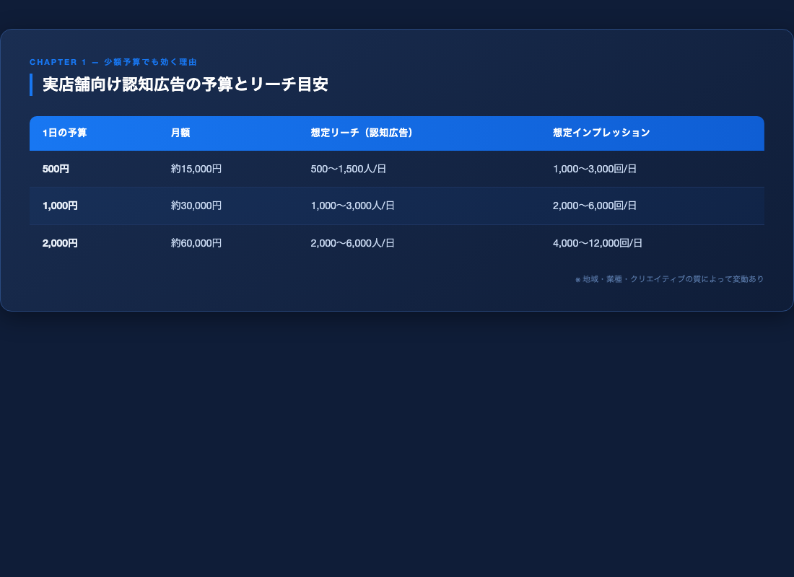

# 第1章｜なぜ少額Meta広告でも集客できるのか

## 「何十万も投下しないと成果が出ない」——これはもう古い常識です

---

「Meta広告は予算がないと意味がない」

この言葉を信じて、広告を諦めているオーナーさんがたくさんいます。

確かに5年前はそうでした。
手動入札・手動ターゲティングが主流だった時代は、データを大量に集めるためのコストが必要でした。

でも今は違います。

---

## 1-1｜Metaの「AI自動最適化」が世界を変えた

2023年以降、Metaは「Advantage+（アドバンテージプラス）」と呼ばれるAI自動最適化を大幅に強化しました。

これが何をするかというと、**あなたの代わりに「誰に見せるか」を自動で学習して最適化してくれる**のです。

以前は広告主が細かくターゲットを設定しなければいけませんでした。
「30代女性・東京在住・美容に興味あり」のように。

でも今のMetaのAIは、少ないデータからでも「この広告に反応しそうな人」を探し出す能力を持っています。

つまり、**少額でも学習が進む**ようになったのです。

---

## 1-2｜1日500円で実際に何が起きるか

「1日500円なんて、誰にも届かないんじゃ？」

そう思う気持ちはわかります。
でも、実際の数字を見てください。

### 実店舗向け認知広告の目安（地域ターゲット：半径5km設定）

| 1日の予算 | 月額 | 想定リーチ（認知広告） | 想定インプレッション |
|-----------|------|----------------------|---------------------|
| 500円 | 約15,000円 | 500〜1,500人/日 | 1,000〜3,000回/日 |
| 1,000円 | 約30,000円 | 1,000〜3,000人/日 | 2,000〜6,000回/日 |
| 2,000円 | 約60,000円 | 2,000〜6,000人/日 | 4,000〜12,000回/日 |

※地域・業種・クリエイティブの質によって変動あり

エステ・脱毛・パーソナルジム・眉サロンは**商圏が狭い**のが特徴です。
来店できる範囲は、お店から半径5km程度。

その限られたエリアに絞れば、1日500円でも十分なリーチが確保できます。

---

## 1-3｜「認知広告」だけに絞るのが少額成功の秘訣

Meta広告には大きく3つの目的があります。

1. **認知**（多くの人に知ってもらう）
2. **検討**（興味を持った人に詳しく知ってもらう）
3. **コンバージョン**（予約・購入してもらう）

少額予算でいきなり「予約を取ろう！」とすると、ほぼ失敗します。
コンバージョン広告はデータ収集に多くの予算が必要だからです。

でも**認知広告**なら話が変わります。

認知広告の目的は「知ってもらうこと」だけ。
CPM（1,000回表示あたりのコスト）は低く、少額でも多くの人に届きます。

そして、この本が最も重視する考え方がここです。

---

## 1-4｜SNS運用が「認知広告の土台」になる

認知広告で「知ってもらった」後、人々はどう動くでしょうか？

気になったら、Instagramを見に行きます。

このとき、あなたのInstagramが以下の状態だったらどうなるでしょう？

❌ 投稿が3ヶ月前で止まっている
❌ プロフィールに何も書いていない
❌ 施術の写真が1枚もない

……そのままそっと画面を閉じられます。

逆に、Instagramがしっかり育っていれば？

✅ フォローされる
✅ ストーリーを見てもらえる
✅ 「行ってみたい」という気持ちが育つ

**広告で「認知」→ Instagramで「信頼」→ 予約へ**

このフローが、少額広告を機能させる本質です。

---

## 1-5｜業種別：実際の費用感と成果の目安

### エステサロン
- 推奨月額: 15,000〜30,000円
- 主な目的: 新規顧客認知・体験予約
- 成果目安: 月2〜5名の新規問い合わせ（6ヶ月運用後）

### パーソナルジム
- 推奨月額: 20,000〜40,000円
- 主な目的: 体験トレーニング申込み
- 成果目安: 月2〜4名の体験申込み（3ヶ月運用後）

### 眉サロン
- 推奨月額: 10,000〜20,000円
- 主な目的: Instagramフォロワー増加・認知拡大
- 成果目安: 月100〜300フォロワー増加（継続運用）

### 脱毛サロン
- 推奨月額: 20,000〜40,000円
- 主な目的: 無料カウンセリング・お試し予約
- 成果目安: 月3〜6名の問い合わせ（3ヶ月運用後）

---

## まとめ：第1章のポイント

- MetaのAI最適化（Advantage+）により、少額でも広告学習が進むようになった
- 実店舗は商圏が狭いため、地域を絞れば1日500円でも十分なリーチができる
- 少額では「認知広告」だけに集中するのが正解
- SNS（Instagram）をしっかり育てることで、広告の効果が何倍にもなる

---

> **次の章では、Instagramと認知広告を正しく組み合わせる具体的な方法をお伝えします。**

▶ Instagram最新情報はこちら: [@your_account]
