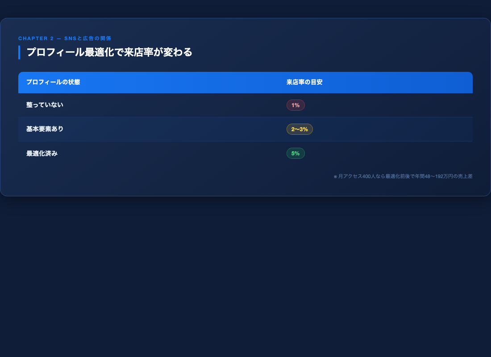
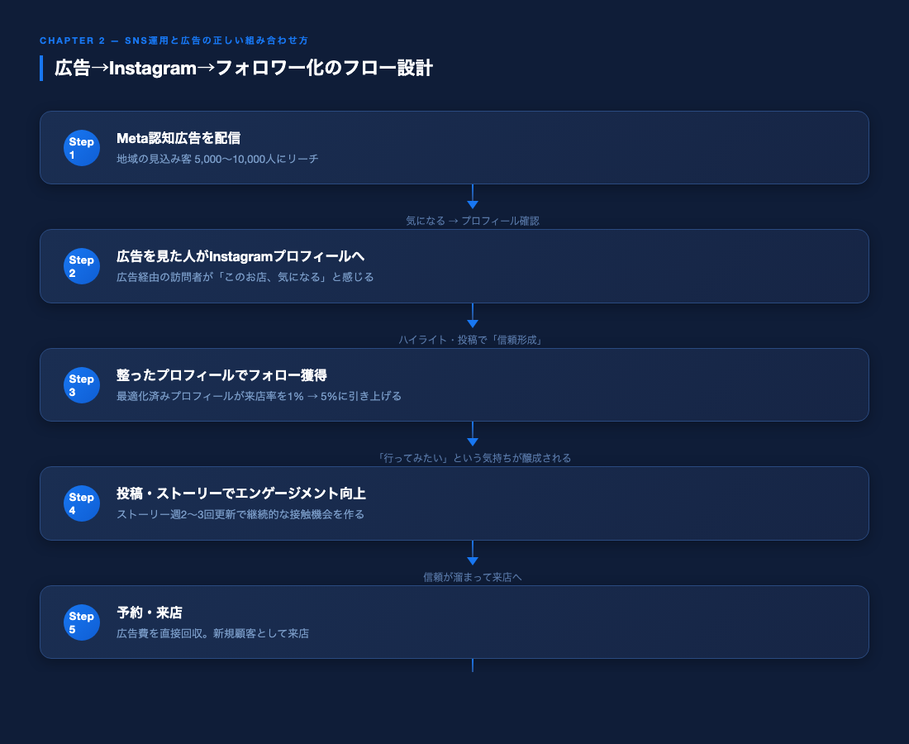
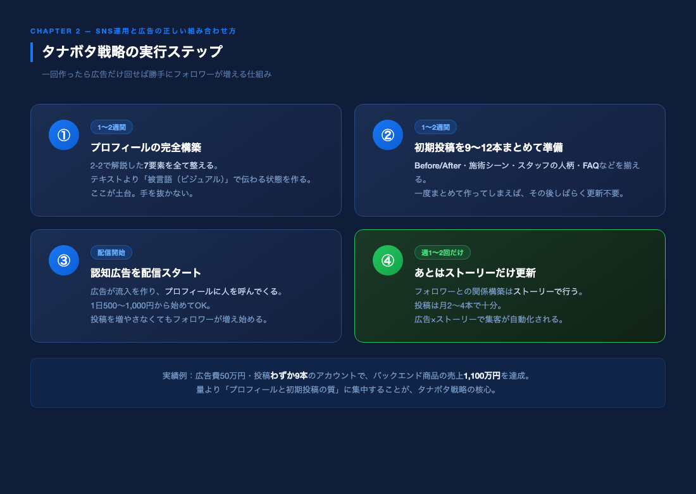

# 第2章｜SNS運用と広告の正しい組み合わせ方

## 広告だけでも、SNSだけでも足りない理由

---

「Instagramはやっているけど、なかなかフォロワーが増えない」
「広告を出してみたけど、お問い合わせに繋がらなかった」

どちらか片方だけでは、なかなか成果が出ません。
この章では、SNS運用と認知広告を正しく組み合わせる方法をお伝えします。

---

## 2-1｜「認知フェーズ」だけに絞る戦略

まず、大前提として理解してほしいことがあります。

少額予算のMeta広告は「認知広告」専用と割り切ってください。

認知広告の唯一の仕事は「あなたのお店・サービスの存在を知ってもらうこと」です。

予約を取ることも、フォロワーを増やすことも、広告に求めない。
ただ「知ってもらう」だけ。

これだけに集中することで、少額予算でも最大のリーチが得られます。

### 認知広告で設定すべき目的
Metaビジネスマネージャーで広告を作成する際、「キャンペーンの目的」を選ぶ画面が出てきます。

ここで選ぶのは：

✅ 「認知度アップ」→「リーチ」または「ブランドの認知度アップ」

この設定が、最も少額予算に適しています。

---

## 2-2｜Instagramプロフィール最適化——7つの要素

認知広告でお店を知った人が最初に見るのは、Instagramのプロフィールです。
ここが整っていないと、広告費が全て無駄になります。

### 「初めましてで100%伝わる」プロフィールを作る

プロフィールは、ホームページと同じと考えてください。

広告経由で初めてあなたのページを訪れた人は、あなたのことを何も知りません。
その人が「このお店、気になる」と思うためには、プロフィールを見た瞬間に必要な情報が全て揃っている必要があります。

重要なのは「1つのCTAに絞る」こと。

「予約はこちら」「LINE登録はこちら」「YouTubeはこちら」と複数の誘導先を並べると、訪問者は迷って離脱します。
一番やってほしいアクションを1つだけ決めて、そこに集中させましょう。

ハイライトも同様です。全て同じ色・同じデザインにするのではなく、一番見てほしいハイライトだけ色を変えて目立たせると、言わなくても誘導できます。

> 実際の事例：愛媛・松山のカフェバーがLINE登録ボタンをプロフィールに設置したところ、フォロワー数よりLINE登録者の方が多くなりました。整ったプロフィールが、言葉なしに行動を促した結果です。

### ① アカウント名（ユーザーネーム）
検索されやすいキーワードを含める。
- ❌ `beauty_salon_mika`
- ✅ `ebisu_eyelash_mika`（地域名＋業種）

### ② プロフィール画像
人の顔、または施術写真を使う。
ロゴだけは避けること（親近感が生まれにくい）。

「怪しそう」という印象を持たれやすい業種（バストアップ・ダイエット系など）は、特に顔出しが重要です。顔が見えるだけで、信頼感が大きく上がります。

### ③ 名前欄（表示名）
地域名＋業種＋特徴を入れる。
- 例：`恵比寿｜まつ毛エクステ｜自まつ毛を傷めない技術`

### ④ プロフィール文（bio）
以下の4要素を100文字以内で。
1. 誰のための（ターゲット）
2. 何が得られるか（ベネフィット）
3. 実績・特徴（信頼）
4. 行動を促す一言（CTA）

例：
```
\大人女性のまつ毛専門サロン/
✦ 自まつ毛を傷めない独自技術
✦ 施術歴8年・3,000名以上
👇 体験予約はこちら
```

### ⑤ ハイライト
お店に来る前の「不安解消」コンテンツを設置。
- メニュー・料金
- 施術の流れ（before/after）
- よくある質問
- スタッフ紹介
- アクセス・予約方法

「最初に見てほしいハイライト」だけ色やデザインを変えて強調しましょう。
全部均等に並べると、どれを見ればいいか分からなくなります。

### ⑥ 投稿の統一感（被言語で伝える）

プロフィールページを見たときの「世界観」が大切です。
最低9枚（3×3のグリッド）は統一したトーンで揃えましょう。

ここで重要なのは「被言語（ビジュアル）で伝える」という考え方です。

テキストのコピーはどのお店も似たり寄ったりになります。
「痩せられます」「きれいになれます」——見飽きた言葉は素通りされます。

それよりも、映像・写真だけで「ここ行きたい」と思わせるコンテンツの方が圧倒的に効果があります。

- 施術シーンを美しく撮る
- スタッフの笑顔・雰囲気を見せる
- 内装・こだわりの道具を映す

「文字を読んでいなくても、眺めているだけで行きたくなる」投稿を意識しましょう。

### ⑦ リンク設定
予約ページまたはLINE公式アカウントへの直リンクを必ず設置。
1つのリンクのみが原則（複数設置すると行動率が下がる）。

---

### プロフィール「100人→5人来店」の計算

プロフィールへのアクセス100人に対して何人が実際に来店・問い合わせるかは、プロフィールの質で大きく変わります。

| プロフィールの状態 | 来店率の目安 |
|-----------------|------------|
| 整っていない | 1% |
| 基本要素あり | 2〜3% |
| 最適化済み | 5% |



月のプロフィールアクセスが400人なら、最適化前後で月4〜16人の差が生まれます。
年間にすると、単価1万円のサロンなら48万〜192万円の売上差になります。

「広告費を増やす」より先に「プロフィールを整える」ことが、最もコスパが高い投資です。

---

## 2-3｜広告→Instagram→フォロワー化のフロー設計

少額Meta広告を使ったフォロワー獲得の流れを整理します。

```
【Step 1】Meta認知広告を配信
   ↓ 地域の見込み客5,000〜10,000人にリーチ

【Step 2】広告を見た人がInstagramプロフィールへ
   ↓ 「気になる→プロフィール確認」

【Step 3】整ったプロフィールでフォロー獲得
   ↓ ハイライト・投稿で「信頼形成」

【Step 4】投稿・ストーリーでエンゲージメント向上
   ↓ 「行ってみたい」という気持ちが醸成される

【Step 5】予約・来店
   ↓
【Step 6】来店客がUGC（口コミ投稿）
   ↓ さらなる認知拡大（広告なしでも広がる）
```



このフローが回り始めると、広告費を増やさなくても徐々に集客の仕組みが育ちます。

---

## 2-4｜「タナボタ戦略」——投稿しなくてもフォロワーが増える仕組み

多くのサロンオーナーが「Instagramを運用しなきゃいけない＝毎日投稿しなきゃいけない」と思っています。

でも、Meta広告を使っている場合、その概念は変わります。

投稿が必要な理由は「プロフィールへの流入を増やすため」です。
広告を回しているなら、広告がその流入を作ってくれています。
つまり、プロフィールを一度しっかり整えれば、投稿は最低限でOKなのです。

この「一回作ったら広告だけ回せば勝手にフォロワーが増える」仕組みを「タナボタ戦略」と呼びます。

実際に、広告費50万円・投稿わずか9本のアカウントで、バックエンド商品の売上1,100万円を達成した事例があります。
投稿を大量に作り続けることに時間を使うより、プロフィールと初期投稿を高品質に仕上げることに集中する方が、圧倒的に効率的です。

### タナボタ戦略の実行ステップ

① プロフィールの完全構築（1〜2週間）
→ 2-2で解説した7要素を全て整える。被言語（ビジュアル）で伝わる状態にする。

② 初期投稿を9〜12本準備（1〜2週間）
→ Before/After・施術シーン・スタッフの人柄・FAQなどを揃える。
→ 一度まとめて作ってしまえば、その後しばらく更新不要。

③ 認知広告を配信スタート
→ 広告が流入を作り、プロフィールに人を呼んでくる。

④ あとはストーリーだけ更新（週1〜2回）
→ フォロワーとの関係構築はストーリーで行う（次の2-5で詳しく解説）。



---

## 2-5｜ストーリー運用——「Instagram版LINE」を使いこなす

### ストーリーはLINEと同じ機能を持っている

多くの人はLINE公式アカウントでリスト管理・配信をしています。
でも、Instagramのフォロワーに対して同じことができると気づいている人は少ない。

Instagramのストーリーは、フォロワーへの「プッシュ通知」です。

- LINEステップ配信でやること → ストーリーでも同じことができる
- LINEで企画告知 → ストーリーで同じ告知ができる
- LINEでセミナー集客 → ストーリーで同じ集客ができる

つまり、フォロワーが増えれば増えるほど、LINEリストと並行して「もう一つのリスト」として機能します。
両方を動かせば、同じ商品でも成約機会が2倍になります。

### ストーリー運用の具体的なやり方

基本ルール：週2〜3回更新するだけでOK

毎日更新する必要はありません。
以下のサイクルを回すだけで十分です。

```
【ストーリー運用の週次サイクル】

月曜：価値提供（施術のTips・よくある質問への回答）
水曜：日常・裏側（スタッフの人柄・サロンの雰囲気）
金曜：CTA（「LINE登録でプレゼント中」「今月の空き枠はこちら」）
```

### ストーリーローンチ——月1回の「集中期間」

フォロワーが増えてきたら、月に1回「ストーリーローンチ」を試してみましょう。

```
【ストーリーローンチの流れ（4週間）】

Week 1：興味喚起
「実は来月、特別なご案内があります」

Week 2：価値提供
「こんな悩みを解決できるようになりました（事例・お客様の声）」

Week 3：詳細告知
「[日時]にLINE登録者限定でご案内します」

Week 4：クロージング
「残り○名です／今日が最終日です」
```

このサイクルをLINEステップ配信と並走させると、同じ商品でも成約数が大幅に増えます。

### AIを活用したストーリー文章の作成

ストーリーの文章は毎回考えなくていいです。

一度「うまくいったストーリーの文章」をChatGPTやClaudeに渡して、「同じトーン・同じ構成でバリエーションを10個作って」とお願いするだけで、テンプレートが自動生成されます。

作業時間は週30分以内で十分です。

---

## 2-6｜何を投稿すればフォロワーが増えるか

プロフィールを整えてタナボタ状態を作った後も、投稿を続けることでさらなる効果が生まれます。

### 実店舗系で反応が取れる投稿の5パターン

① Before/After（最強コンテンツ）
施術前後の変化を見せる投稿。
眉サロン・脱毛・エステで特に効果大。
※ 必ずモデルの許可を取ること。

② 「なぜ」コンテンツ
- 「なぜうちのジムは体重計を置いていないのか」
- 「なぜエステ後に紫外線対策が必要なのか」
お客様の「なるほど！」を引き出す教育投稿。

③ スタッフの日常・こだわり（被言語で伝える）
人柄が伝わるコンテンツ。「この人に任せたい」という信頼が生まれる。
文字で「親切なスタッフです」と書くより、笑顔で丁寧に施術している映像1本の方が100倍伝わります。

④ お客様の声（許可を得た上で）
実際の感想。テキストカードでも十分効果あり。

⑤ お店の説明動画（「案内動画」を1本作っておく）
「来店前の不安を全て消す動画」を1本作って、プロフィールの固定投稿に置いておくのが最も効果的です。
- アクセス方法
- 施術の流れ・所要時間
- よくある質問への回答
- 料金・支払い方法

これが1本あるだけで、来店率が大きく変わります。

### 投稿頻度の目安（タナボタ戦略採用後）
- 投稿：月2〜4本（最低限でOK）
- ストーリーズ：週2〜3回
- 「案内動画」：1本を固定・ハイライトに設置

---

## まとめ：第2章のポイント

- 少額予算では「認知広告」に専念し、予約獲得は広告に求めない
- Instagramプロフィール＝ホームページ。「初めましてで100%伝わる」状態に整える
- 1つのCTAに絞り、被言語（ビジュアル）で「行きたい」と思わせる
- プロフィールを整えたら「タナボタ戦略」で広告だけ回せば勝手にフォロワーが増える
- ストーリー＝Instagram版LINE。フォロワーへのプッシュ配信として活用する

---

> 次の章では、業種別のターゲット設定を具体的に解説します。

▶ Instagram最新情報はこちら: [@your_account]
